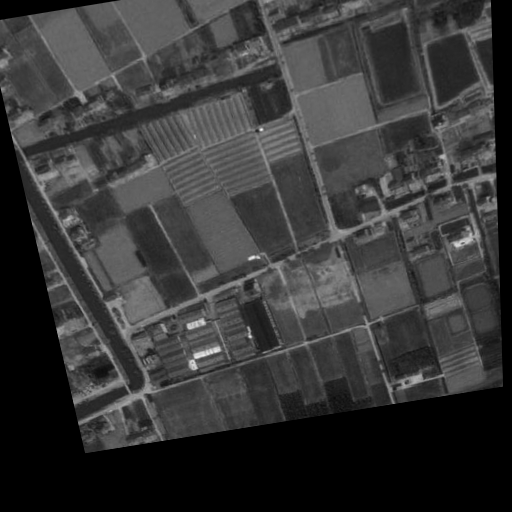
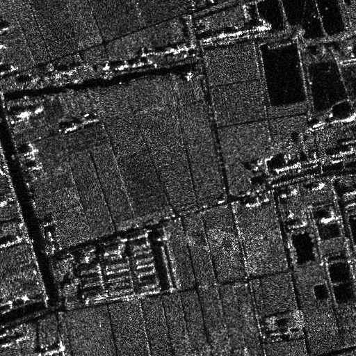
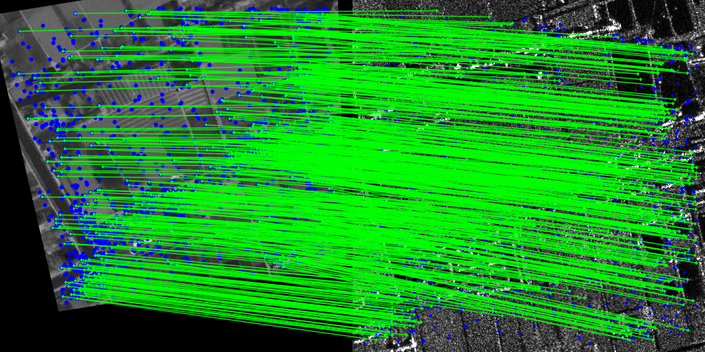
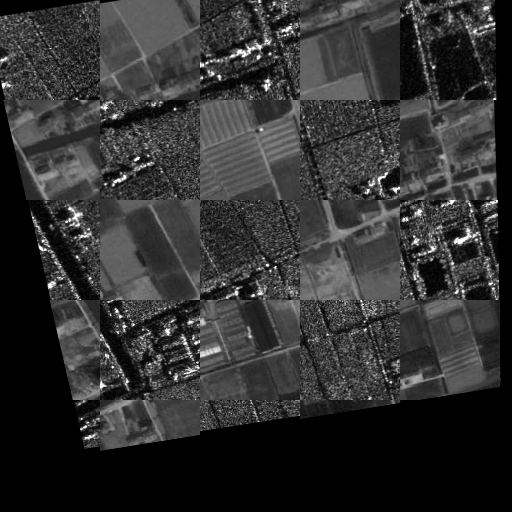

# Modality-Invariant Optical–SAR Image Registration using Hierarchical Structural Cognition Prior
Code for paper "Modality-Invariant Optical–SAR Image Registration using Hierarchical Structural Cognition Prior"

# Project Description

## requirements

- Python Version: Python `3.8+` is recommended.

- Ensure that `requirements.txt` is present in the root directory of your repository, then execute:

`pip install -r requirements.txt`

## Weight
- `checkpoints`：The original training weights for the **OSdataset** and **WHU-SEN-City** datasets are provided.

## Dataset
- The datasets used in the experiments are **OSdataset** and **WHU-SEN-City**, with image dimensions of **512×512**.
- Download link for OSdataset：
- Download link for WHU-SEN-City：
- The datasets should be placed separately in `VIS_SAR` under `Evaluation_OSdataset` and `Evaluation_WHU_SEN_City`.

## Train
- `train.py`：The script for training weights stores the trained weights and training logs in the `checkpoints` folder.

## Evaluation
- `Evaluation_OSdataset / Evaluation_WHU_SEN_City`：Contains evaluation files for two separate datasets, enabling:
  - Key Point and Feature Description Extraction
  - Keyword Matching
  - Image Registration
  - Output visualizations and metrics

The main contents of the evaluation catalog are as follows:

- `VIS-SAR/`：Dataset storage folder
- `extract_feature.py`：Keypoint and Feature Description Extraction Script, Outputting `.mat` Files to the `feature` Folder
- `match.py`：Extract the `.mat` files output by `extract_feature.py`, perform optical SAR image keypoint matching, and save the visualizations and metric results to the `result` folder.
- `reproj.py`：Extract the `.mat` files output by `extract_feature.py`, perform optical SAR image registration, and save the visualization and metric results to the `result` folder.

## Registration Example

### Optical-SAR imagery

  
  

### Matching Visualization

### Registration Visualization

	
